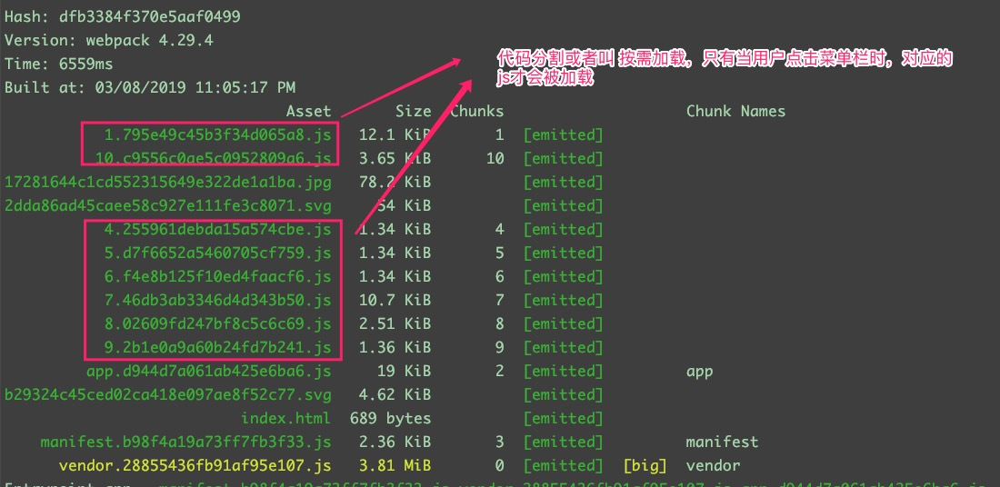
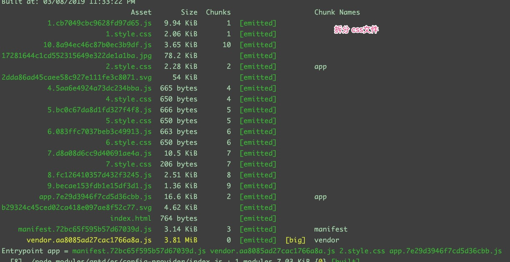
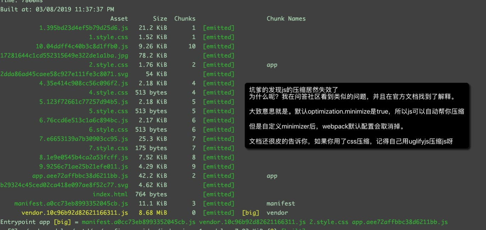
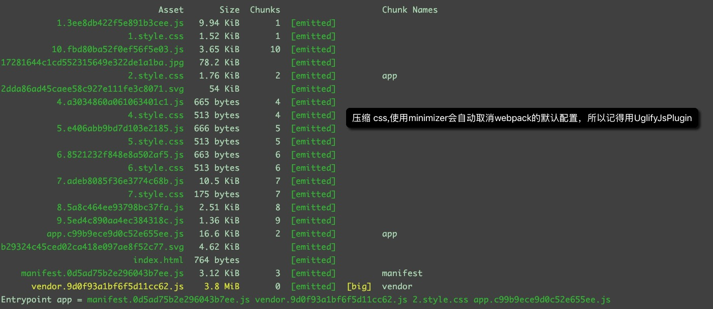

# 动态路由/react按需加载
## 原理
利用 import('path') 返回一个promise， 可以通过该 promise得到 要加载的模块

代码分割或者说懒加载，是 webpack 从诞生就一直标榜的功能吧。

它的作用就是把 js 分割成几份，在用户需要加载时才加载，这样不用一次性加载所有 js。

那么在 webpack 里实现代码分割并不是用配置的方式，而是通过我们写代码的方式来告诉 webpack 哪些代码要分割

webpack 里有 2 种 webpack 分割方法

webpack 内置方法 : 
+ require.ensure() 和 require.include()
+ es2015 定义的 动态 import,import 返回 promise

## AsyncLoadComponent
```js
const AsyncLoadComponent = (loadComponent) => {
  class AsyncComponent extends React.Component {
    constructor(props) {
      super(props)
      this.state = {
        Component: null,
      }
    }

    componentWillMount() {
      if (this.hasLoadedComponent()) {
        return;
      }
      // 加载模块
      loadComponent()
        .then(module => module.default)
        .then((Component) => {
          this.setState({ Component });
        })
        .catch((err) => {
          throw err;
        });
    }

    // 是否 加载了 模块
    hasLoadedComponent() {
      const { Component } = this.state
      return Component !== null;
    }

    render() {
      const { Component } = this.state;
      return (Component) ? <Component {...this.props} /> : null;
    }
  }
  // 注意这里返回的是 组件 而不应该是  class
  return <AsyncComponent />
}
```
## menuList
```js
const menuList = [
  {
    key: '1',
    icon: 'pie-chart',
    title: '工作台',
    path: '/dashboard',
    component: AsyncLoadComponent(() => import('../views/content/dashboard')),
    isSub: false,
  },
]
```


# 强制登录
## AuthorizedRoute
```js
const AuthorizedRoute = ({ render: localRender, ...rest }) => {
  const isLogin = sessionStorage.getItem('username')
  if (!isLogin) {
    localRender = () => <Redirect to="/user/login" />
  }
  return (
    <Route
      {...rest}
      render={localRender}
    />
  )
}
```


# mysql 如何拼接sql
## mysql.format
```js
class OrderDao {
  // 查询 订单列表
  static async getOrderList (queryObject) {
    let sqlWhere = ''
    for (let key in queryObject) {
      const value = queryObject[key]
      console.log(key, value)
      if (value && value !== '') {
        sqlWhere += `AND ${key} = ${value} `
      }
    }
    const sql = `SELECT * FROM ?? where 1 = 1 ${sqlWhere}`
    const inserts = ['order']

    console.log(mysql.format(sql, inserts))
    const result = await query(mysql.format(sql, inserts))
    return result
  }
}
```

# webpack 生产环境打包优化

## 静态文件的路径 && hash缓存
```js
  output: {
    filename: '[name].[chunkhash].js', // chunkhash 每个文件拥有独立的hash
    publicPath: cdnConfig.host, // 让 打包生成的静态文件 前缀为 七牛CDN的域名
    path: path.join(__dirname, '../dist')
  }
```
## 代码分割/react的按需加载
> 原理： 利用 import('path') 返回一个promise， 可以通过该 promise得到 要加载的模块

## 处理css
### 拆分出单独的css文件

```js
module: {
    rules: [
      {
        test: /\.scss$/,
        use: [
          {
            loader: MiniCssExtractPlugin.loader
          },
          {
            loader: 'css-loader' // 将 CSS 转化成 CommonJS 模块
          },
          {
            loader: 'sass-loader' // 将 Sass 编译成 CSS 放在最后的 loader 首先被执行
          }
        ]
      }
    ]
  },
```
## 拆分css导致webpack默认的js压缩失效

```js
      new OptimizeCssAssetsPlugin({})
```
## 使用UglifyJsPlugin 压缩js

````js
new UglifyJsPlugin({
        // 压缩 js
        uglifyOptions: {
          ecma: 6,
          cache: true,
          parallel: true
        }
      })
````

